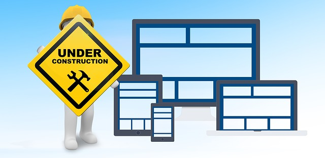

# BUILD DAY:tada::balloon::boom:

###### Photo obtained from Pixaby. No attribution is required. However, as a thank you to and visibility for, Pixaby and the author, [here's a link to the image](https://pixabay.com/illustrations/maintenance-under-construction-2422171/) by [geralt](https://pixabay.com/users/geralt-9301/) on [Pixabay's website](https://pixabay.com/).

##[Frontend Mentor Challenges](https://frontendmentor.io)
Worked on the [Intermediate-level huddle landing page](https://www.frontendmentor.io/challenges/huddle-landing-page-596348). Chrome Dev tools has been inconsistently displaying the mobile version of the site which has made progress slow. 
Worked on layout of elements on the page. [Here's the page](https://bviengineer.github.io/frontendmentor.io-huddle-landing-page/) and because I'm still working on responsiveness it's best viewed at 375px.