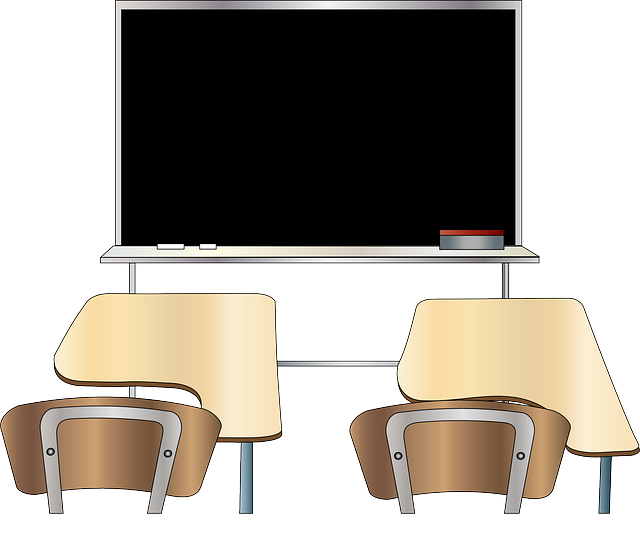

# THEORY | LECTURE DAY! :school::book::pen::computer:
 
###### Photo obtained from Pixaby. No attribution is required. However, as a thank you to and visibility for, Pixaby and the author, [here's a link to the image](https://pixabay.com/vectors/classroom-blackboard-class-learning-42275/) by [Clker-Free-Vector-Images](https://pixabay.com/users/Clker-Free-Vector-Images-3736/) on [Pixabay's website](https://pixabay.com/).
<hr>

## [App Academy Online FREE Full-Stack Curriculum](https://open.appacademy.io)
Reviewed Array Methods and enumerables. Here's the link to my `Ruby` [repl.it](https://repl.it/@bviengineer/StupidOurCommunication) for today's review lessons as journaled below.
* `arr << "test"` => adds a single element to the end of an arry
* `arr.push()` => can add multiple elements to the end of an array
* `arr.pop()` => removes a single element from the end of an array
* `arr.shift()` => removes an element from the beginning of an array
* `arr.unshift()` => adds an element to the beginning of an array
* `arr.index("element")` => returns the index of the located item & if the element is not found nothing will be returned
* `arr.include?("element")` => returns a boolean (true or false)
  ```ruby
    str = 'hello'

    # .include?()
    puts str.include?('e') # true
    puts str.include?('E') # false 
    puts str.include?('ello') # true

    # .index()
    puts str.index("ello") 
    # 1 because the index of the specificed string 'ello' begins at 
    # index 1

    puts str.index("ello2") 
    # nothing is returned because the exact string is not found 
  ```
* `.reverse` & `reverse!` => works on both arrays and strings and evaluates to a new array/string which can be saved to a variable
  ```ruby
    arr = [1, 2, 3, 4]

    print arr.reverse # [1, 2, 3, 4]
    # original array remains unchanged
    # to see new results save the outcome to a new variable
    
    newArr = arr.reverse
    print newArr # [4, 3, 2, 1] 
    # reversed array is saved to a new varaible and the original 
    # array remains unchanged 

    prints arr.reverse! # [4, 3, 2, 1]
    # the content of the original array is altered 
  ```
* `palindromes` => checks to see if a string is the same forwards and backwards by returing a boolean value, `true` or `false`
  ```ruby
    def is_palindrome(word)
      return word == word.reverse    
    end

    puts is_palindrome('madam') # true
    puts is_palindrome('hello') # false
  ```
* `range slicing` using `[index..index]` and `[index...index]` => obtaining a number of array elements at a given time. It works on arrays and strings
  ```ruby
    arr = ["a", "b", "c", "d", "e"]
    
    print arr[1..3] 
    # 2 dots
    # obtains the elements at index 1 through index 3 INCLUSIVE
  
    print arr[1...3]
    # 3 dots
    # obtains the elements at index 1 through index 3 EXCLUSIVE

    str = 'bootcamp'
    print str[1..3]
    # 2 dots
    # OUTPUT: oot
    
    print str[1...3]
    # 3 dots
    # OUTPUT: oo
    
    print str[1..-1]
    # 2 dots
    # OUPUT: ootcamp
    # -1 indicates to begin at the end of the string
    # 1 indicates to end at the character located at the first index 
    # in the string

    print str[0...-1]
    # 3 dots
    # OUTPUT: bootcam
    # -1 indicates to begin at but EXCLUDE the last character 
    # in the string 
    # 0 indicates to end at the character located at index 0 
    # in the string
  ```
  <hr>