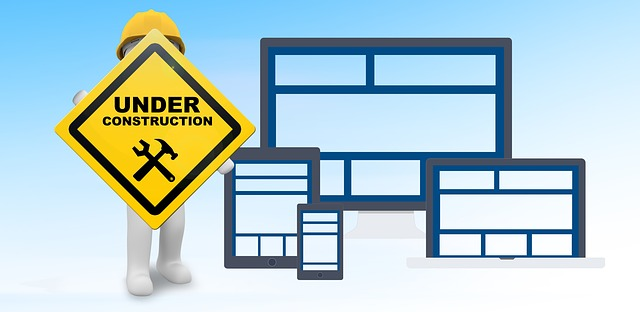

# BUILD DAY:tada::balloon::boom:

###### Photo obtained from Pixaby. No attribution is required. However, as a thank you to and visibility for, Pixaby and the author, [here's a link to the image](https://pixabay.com/illustrations/maintenance-under-construction-2422171/) by [geralt](https://pixabay.com/users/geralt-9301/) on [Pixabay's website](https://pixabay.com/).

## [FreeCodeCamp](https://freecodecamp.org)
I'm working my way thorugh the Responsive Web Design Projects on [FreeCodeCamp](https://freecodecamp.org) and is currently on project #3: **Build a Product Landing Page**. The project is to be [functionally similar to the project provided here](https://codepen.io/freeCodeCamp/full/RKRbwL).
* Worked on the navigation part of the page and have a few changes to make. The GitHub repo is currently private and the code is not available for review. Updates will be posted on CodePen and the linke will be provided.
