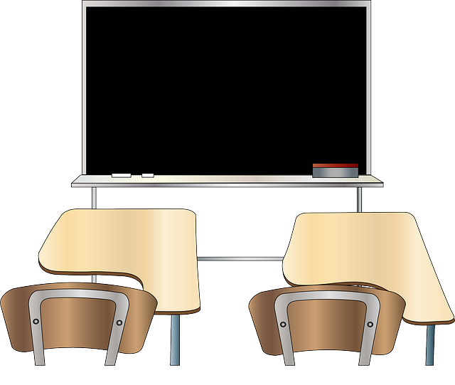

 
###### Photo obtained from Pixaby. No attribution is required. However, as a thank you to and visibility for, Pixaby and the author, [here's a link to the image](https://pixabay.com/vectors/classroom-blackboard-class-learning-42275/) by [Clker-Free-Vector-Images](https://pixabay.com/users/Clker-Free-Vector-Images-3736/) on [Pixabay's website](https://pixabay.com/).
<hr>

## [App Academy FREE Online Full-Stack Curriculum](https://online.appacademy.io)
Continued review of **Array Methods & Enumerables** and reviewed:
* `.split()` =>   * can only be used or _called_ on strings and **returns an array** 
  ```ruby
    str = "Follow the yellow brick road"

    puts str.split(" ") # tells ruby to split the string wherever 
    # there are spaces
    
    # output
      # Follow
      # the
      # yellow
      # brick
      # road

    print str.split(" ") 
    # tells ruby to split the string wherever 
    # there's a space which isolates each word

    # output
      # ["Follow", "the", "yellow", "brick", "road"]

  ```
* `.join()` => can only be _called_ on on arrays and **returns a string**
  ```ruby
    arr = ["Follow", "the", "yellow", "brick", "road"]

    print arr.join(" ")

    # output
      # Follow the yellow brick road    
  ```

* Other useages of `.spilt()` and `.join()`
    ```ruby
    # using .split() to split a string on each character
        string = "table"

        print string.split("") #no space between the "" quote marks
        # output: ["t", "a", "b", "l", "e"]


    # CHAINING .split() and .join() together
    my_house = "table cloths"

    print string.split("l").join("X")
    
    # output 
      # tabXe cXoths
       # the string is split into an array wherever there's a lower case
        # "L".  The l's are removed and then the array is joined together
        # as a string, replacing appearances of l's with X's. 
    ```

See my **[Ruby Repl.it](https://repl.it/@bviengineer/StupidOurCommunication)** here to run the code examples